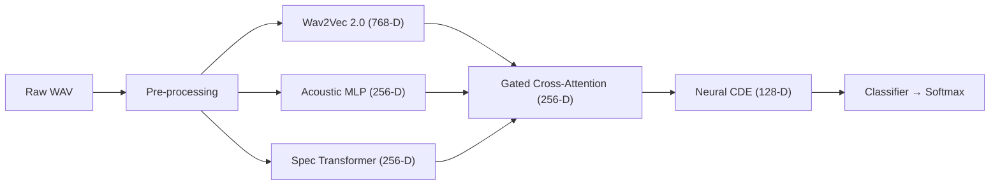

# EmotiFuse

EmotiFuse is a research-grade audio-emotion-recognition library that combines  
(1) a self-supervised speech encoder (Wav2Vec 2.0),  
(2) handcrafted acoustic descriptors, and  
(3) a spectrogram-Transformer branch.  
The three representations are fused through **gated cross-attention** and then modeled in continuous time with a **Neural Controlled Differential Equation (NCDE)**.

---

## Features

1. **Wav2Vec 2.0 branch** – frame-level contextual embeddings, dimension **768**  
2. **Acoustic-feature MLP branch** – MFCC + Δ/ΔΔ + pitch + energy, dimension **256**  
3. **Spectrogram-Transformer branch** – ViTSER-style with deformable attention, dimension **256**  
4. **Gated cross-attention fusion** of the three branches  
5. **NCDE backbone** for temporal dynamics  
6. Clean training / inference API (PyTorch ≥ 2.0; CPU & CUDA)

---

## High-Level Architecture

⸻

Mathematical Formulation

1. Pre-processing
	•	Resample to 16 kHz mono.
	•	Pre-emphasis filter

y[n] = x[n] - 0.97\,x[n-1]

	•	VAD – drop frames whose RMS < −40 dB.

2. Branch Embeddings

2.1 Wav2Vec 2.0

\mathbf{e}_t \in \mathbb{R}^{768}

2.2 Acoustic-feature MLP

\mathbf{f}_t = [\text{MFCC}_{1\dots 39},\; p_t,\; e_t] \in \mathbb{R}^{41}

\mathbf{m}_t = \mathrm{ReLU}\!\Bigl(
  W_2\,\mathrm{ReLU}(W_1\,\mathbf{f}_t + b_1) + b_2
\Bigr) \in \mathbb{R}^{256}

2.3 Spectrogram-Transformer

\mathbf{s}_t = \mathrm{Transformer}(S)_t \in \mathbb{R}^{256}

3. Gated Cross-Attention

H_t = [\mathbf{e}_t;\mathbf{m}_t;\mathbf{s}_t] \in \mathbb{R}^{3\times256}

\mathbf{g}_t = W_g H_t + b_g,\;
\alpha_{t,i} = \frac{e^{g_{t,i}}}{\sum_{j=1}^3 e^{g_{t,j}}}

\mathbf{h}_t = \sum_{i=1}^3 \alpha_{t,i}\,\mathbf{b}_{t,i},
\quad
(\mathbf{b}_{t,1},\mathbf{b}_{t,2},\mathbf{b}_{t,3})
= (\mathbf{e}_t,\mathbf{m}_t,\mathbf{s}_t)

4. Neural CDE

\mathrm{d}\mathbf{z}(t) = f_\theta(\mathbf{z}(t))\,\mathrm{d}X(t),\;
\mathbf{z}(0)=\mathbf{0}

Euler update (implementation):

\mathbf{z}_{n+1} =
  \mathbf{z}_{n} + f_\theta(\mathbf{z}_{n})\,(\mathbf{h}_{n+1}-\mathbf{h}_{n})

5. Classifier

\hat{\mathbf{y}} =
  \mathrm{softmax}(W_c\,\mathbf{z}(T) + b_c) \in \mathbb{R}^{C}

⸻

Parameter Budget (excludes frozen Wav2Vec)

Module	Output	Parameters
Acoustic MLP (41→256→256)	256	8.5 × 10⁴
Spectrogram Transformer (2 blocks)	256	2 × 10⁶
Gating + Fusion	256	2 × 10³
NCDE MLP (128→128)	128	1.6 × 10⁴
Classifier (128→64→C)	C	1 × 10⁴
Total (excl. encoder)	—	≈ 2.1 M

⸻

Quick-Start

# clone (not yet on PyPI)
git clone https://github.com/yourname/emotifuse.git
cd emotifuse
poetry install        # or: pip install -e .

from emotifuse import EmotiFuse, infer
model = EmotiFuse("checkpoints/")
print(infer("audio/happy.wav"))

⸻

Development

git clone https://github.com/yourname/emotifuse.git
cd emotifuse
poetry install        # or: pip install -e .

pytest -q             # run tests
black . && flake8     # format & lint

⸻

License

MIT © Jaden Fix

